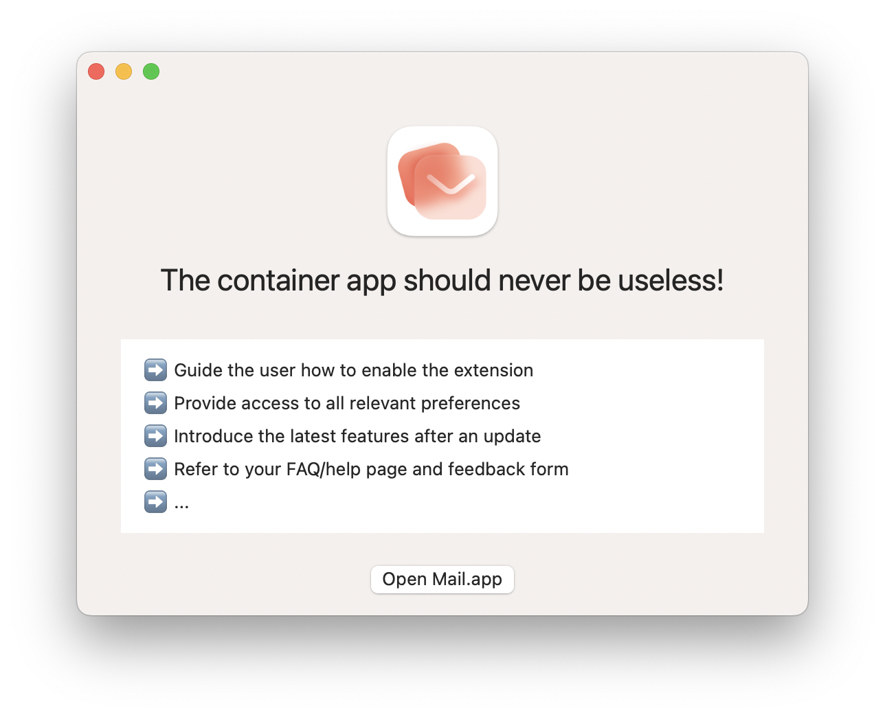
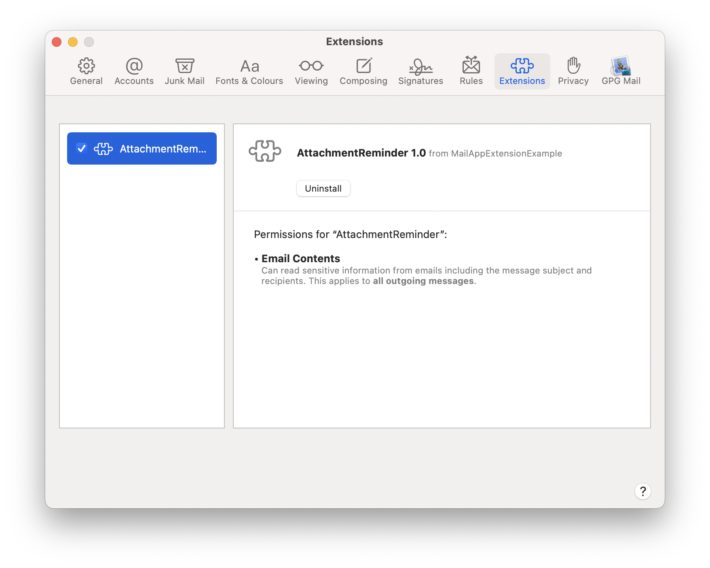
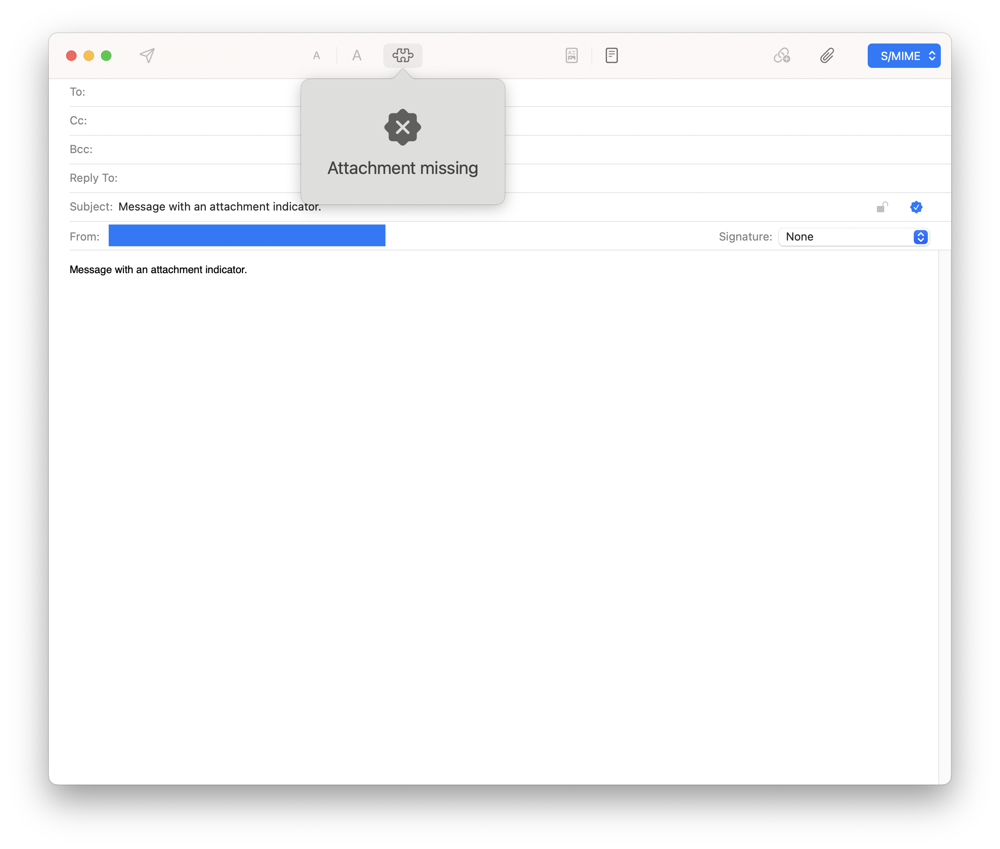

    
    <h1>Mail App Extension Example</h1>
    
<b>Contains the "AttachmentReminder" target</b>

     
     
     

At WWDC21, the MailKit API was introduced to develop [Mail App Extensions](https://developer.apple.com/videos/play/wwdc2021/10168/). Unfortunately, there are still very few native Mail App Extensions in the App Store. Therefore, Apple announced further features for Mail.app in macOS at [WWDC22](https://developer.apple.com/videos/play/wwdc2022/101/). Starting with macOS Ventura, there are features like "Undo Send", "Scheduled Send", "Follow Up" and "Remind Me". One very basic feature is still missing though: a reminder when attachments are missing.

This repository contains a sample implementation for such a Mail App Extension. The "MailAppExtensionExample" container app contains the "AttachmentReminder" target that shows a warning when the attachment of an email is missing.

## ⚠️ Bugs in MailKit
There are several bugs in MailKit that have not yet been fixed by Apple in macOS 12.4. For this reason, the Mail App Extension does not work correctly. The bugs have been reported to Apple and should be fixed in future macOS versions. As soon as a bug fix exists, the development will be completed.

1. `allowMessageSendForSession(_:completion:)` and `allowMessageSendForSession(_:)` are never called by the framework (FB10533807)
2. `session.mailMessage.rawData` and `session.composeContext.originalMessage?.rawData` always return nil (FB10533893)

A feature request was also submitted to enable functionalities of Safari App Extensions in Mail App Extensions as well.

1. Open "Mail App Extension" preferences panel in Mail.app and check state of extensions (FB10534874)

